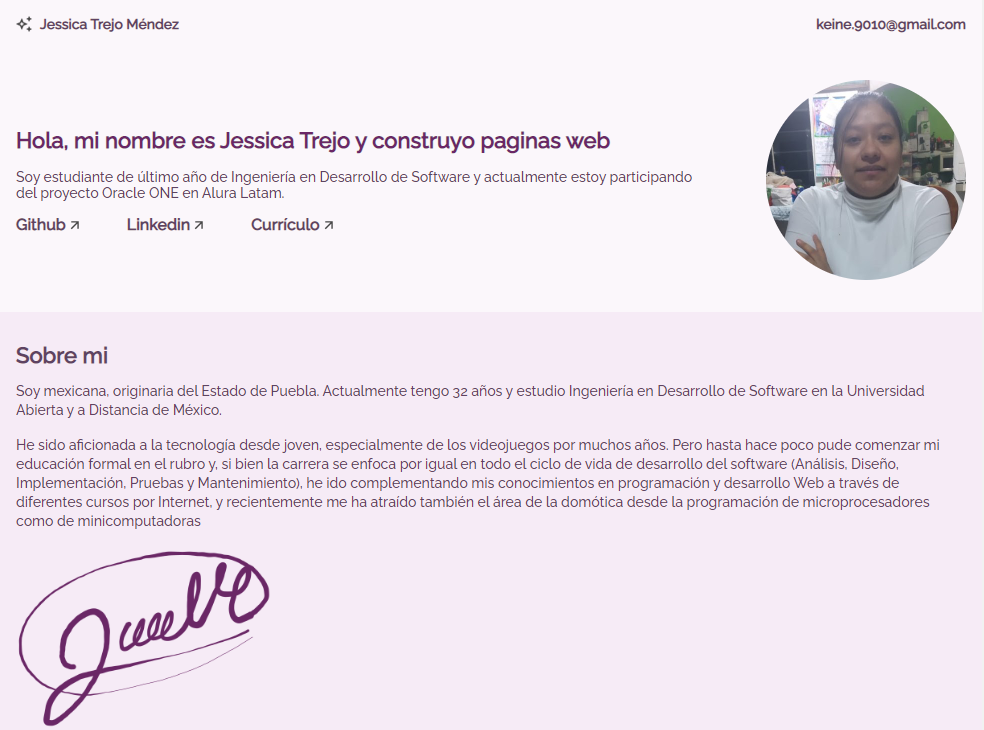

# Challenge ONE | HTML CSS JavaScript | Front-end | Portafolio

     Sitio web con el portafolio de proyectos personal.

---

## 🖥️ Tecnologías Utilizadas:

- HTML CSS JavaScript
- Visual Studio Code  

---

Alura - Portafolio  

[Link al sitio web](https://keinetm.github.io/OneNextEducation-CV/)

     En este proyecto de práctica para Front-End se utilizaron los conocimientos adquiridos, sobretodo en CSS, para elaborar una página web para presentar y organizar nuestro portafolio de proyectos, en estos se incluyen los elaborados en los cursos y Challenges del curso de Alura - Oracle One Next Education.

     Se pretendende actualizar este repositorio con los proyectos nuevos que se vayan elaborando de este momento en adelante con la finalidad de emplearlo como parte de un Currículum propio que mueste las habilidades que se van desarrollando y puliendo con la experiencia.

